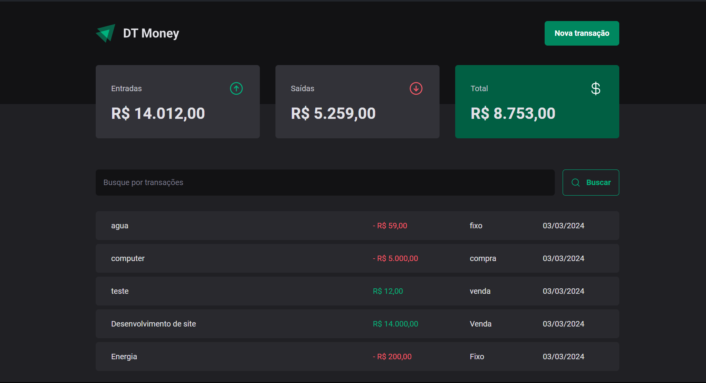

# DT Money



## Índice

- [Descrição do Projeto](#descrição-do-projeto)
- [Tecnologias Utilizadas](#tecnologias-utilizadas)
- [Executar Projeto](#executar-projeto)

## [Descrição do Projeto](#descrição-do-projeto)

DT Money é uma aplicação de controle financeiro, onde é possível cadastrar e excluir transações e ver o saldo de entrada e saída.

## [Tecnlogias Utilizadas](#tecnologias-utilizadas)

<div style="display: flex; flex-direction: column; align-items: center;">
  <a href="https://skillicons.dev">
    
  </a>
React
</div>
<br>

<div style="display: flex; flex-direction: column; align-items: center;">
  <a href="https://skillicons.dev">
    
  </a>
Typescript
</div>
<br>

<div style="display: flex; flex-direction: column; align-items: center;">
  <a href="https://skillicons.dev">
    
  </a>
Styled Components
</div>
<br>

<div style="display: flex; flex-direction: column; align-items: center;">
  <a href="https://skillicons.dev">
    
  </a>
Vite
</div>
<br>

<br>

## [Executar projeto](#executar-projeto)

### Instalar dependências

```bash
$ npm install
```

### Rodar API Json Server

```bash
$ npx json-server server.json

```

### Rodar Localmente

```bash
$ npm run dev
```
